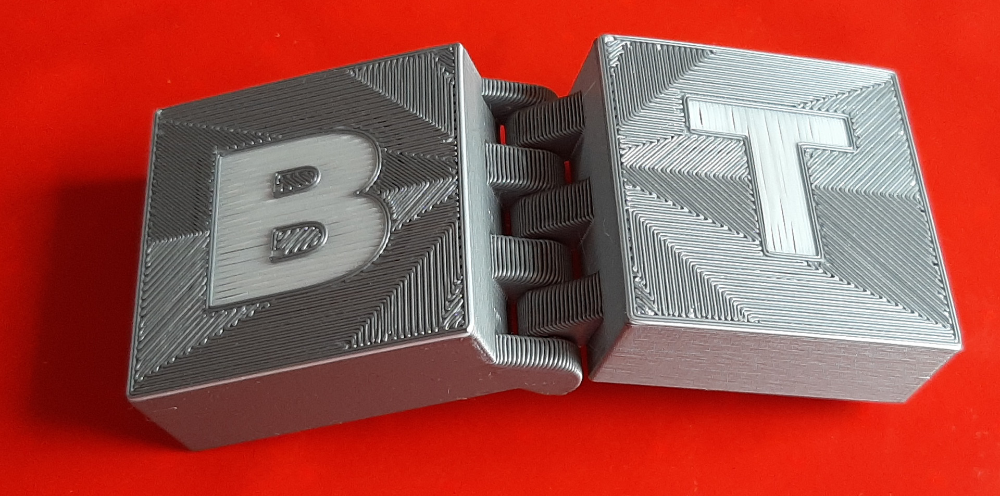
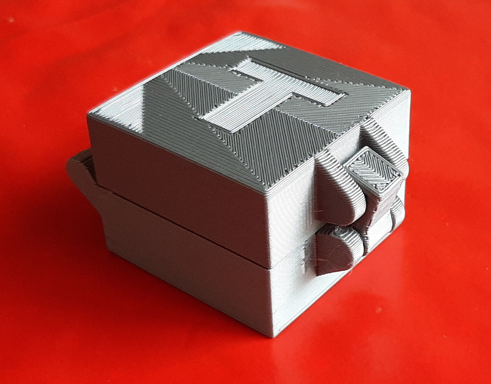
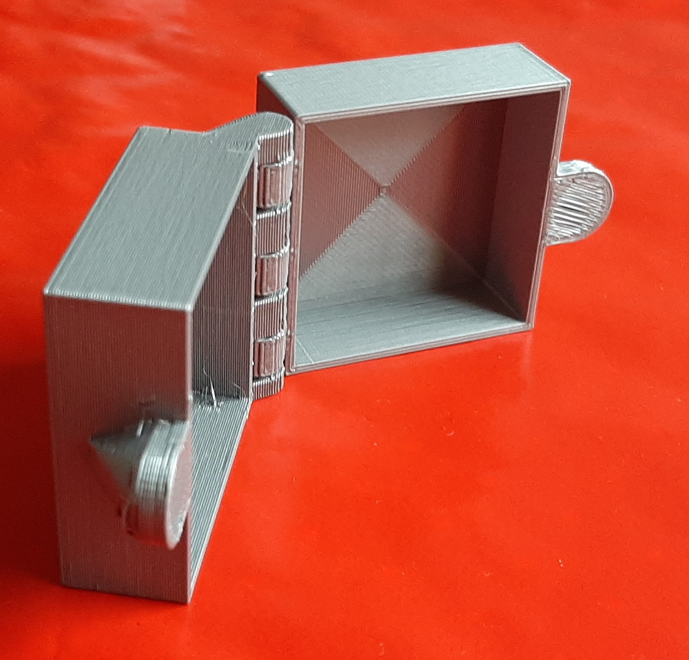

Sometime, I need simple boxes with labels to keep stuffs organized.

You can choose between 3 types of latches:
 - the original one

 - the buckle

 - magnets

Two SVG/DXF files can be imported on the bottom and top faces of the box.
The logos will be resized to a square surface. 
Openscad won't interpret spline curve. Convert them to polylines...

I remixed https://www.thingiverse.com/thing:82533 and https://www.thingiverse.com/thing:82620
The changes are:
 - merging the two things in one. Now the type of latch can be chosen in the customizer
 - adding the logos on the bottom and the top face
 - adding the magnet latch type. You can pause your print to insert magnets.
 - organizing the parameters with sections, drop boxes, range values, ...

I printed my boxes with 0.3 layer height but you can use a better quality without problem.
No raft, no support needed.

Published on:
- [Thingiverse](https://www.thingiverse.com/thing:5182021)
- [Prusaprinters](https://www.prusaprinters.org/fr/prints/109894-parametric-hinged-box-with-latch-and-logos-and-pri)
